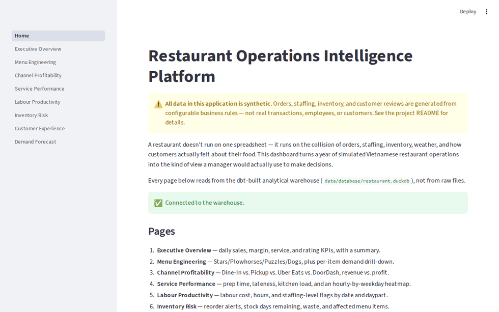

# Restaurant Operations Intelligence Platform

[](https://github.com/sagameko/Restaurant-Management/actions/workflows/ci.yml)


A restaurant doesn't run on one spreadsheet — it runs on the collision of
orders, staffing, inventory, weather, and how customers actually felt
about their food. This project builds that whole story from scratch: a
synthetic Vietnamese restaurant, simulated day by day for a year, whose
data actually behaves the way a real kitchen does — get busy enough and
prep times climb, ratings dip, and stock runs thin.

It's a full pipeline, not a notebook: a reproducible Python data
generator with real operational logic, a dbt-on-DuckDB warehouse with a
proper star schema, and a Streamlit app that turns all of it into
decisions a restaurant manager could actually use.

The central project question:

> How can restaurant order, staffing, inventory, menu and customer-experience
> data be combined to improve daily operational decisions?

## Why I built this

This started as a strict, spec-driven build: the brief required working
incrementally, phase by phase, and treating each layer's correctness as
something to *verify against real generated data*, not just assume from
the formulas. That discipline turned out to be the actual point — a
synthetic dataset is only useful if it behaves the way the real thing
would, and most of the interesting work was in catching the gap between
"the code runs" and "the data is actually right" (see
`docs/development_log.md` for the specific bugs that gap produced, and
`docs/project_decisions.md` for the reasoning behind the bigger calls).
Once the original scope was done, I extended it with a real-time layer —
a live order-event stream over WebSockets — specifically to go past
batch analytics into a system that has to keep behaving correctly
*while running*, not just once at build time. Different problem,
different failure modes, worth understanding both.

## Contents

- [Demo](#demo)
- [Disclaimer](#disclaimer)
- [Tech stack](#tech-stack)
- [Status](#status)
- [Setup](#setup)
- [Seed data](#seed-data)
- [Generating synthetic operational data](#generating-synthetic-operational-data)
- [Loading into DuckDB and running dbt](#loading-into-duckdb-and-running-dbt)
- [Running the dashboard](#running-the-dashboard)
- [Running the live order stream](#running-the-live-order-stream)
- [Development](#development)

## Demo

```bash
uv sync
uv run streamlit run app/Home.py
```

Opens at `http://localhost:8501`. The dashboard reads from the dbt-built
warehouse (`data/database/restaurant.duckdb`) — if it isn't built yet,
see [Generating synthetic operational data](#generating-synthetic-operational-data)
and [Loading into DuckDB and running dbt](#loading-into-duckdb-and-running-dbt)
below first.

[](docs/screenshots.md)

**→ [See all 8 pages in `docs/screenshots.md`](docs/screenshots.md)** —
Executive Overview, Menu Engineering, Channel Profitability, Service
Performance, Labour Productivity, Inventory Risk, Customer Experience,
and Demand Forecast, each with a short description of what it shows.
All data shown is synthetic; see the disclaimer below.

## Disclaimer

Every number in this repository is synthetic, generated from the
configurable business rules in `config/`. Menu names, categories, and
prices are illustrative and representative of a casual Vietnamese
restaurant — not scraped, copied, or sourced from any specific real
business. No confidential customer, employee, supplier, recipe,
financial, or transaction data appears anywhere in this project.

## Tech stack

| Layer | Technology | Why |
|---|---|---|
| Language & tooling | Python 3.12, [uv](https://docs.astral.sh/uv/) | Fast, modern dependency management — no separate pip/venv/poetry dance. |
| Data generation | pandas, NumPy | A seeded `numpy.random.Generator` threaded through every generator function makes the whole year reproducible from one `--seed`. |
| Validation | Pydantic v2 | Seed data (menu, ingredients, employees...) is validated row-by-row on load; generated tables use vectorised pandas checks at scale. |
| Warehouse | [DuckDB](https://duckdb.org/) | Single-file, zero-config, embedded OLAP engine — no server to run for ~170k rows of synthetic data. |
| Transformation | [dbt](https://www.getdbt.com/) | Layered SQL (staging → intermediate → dimensions/facts → marts), with dependency resolution, testing, and docs built in. |
| App | [Streamlit](https://streamlit.io/) + Plotly | Eight pages reading straight from the dbt marts. |
| Forecasting | [scikit-learn](https://scikit-learn.org/) | Naive/moving-average baselines vs. linear regression and random forest, time-based validated. |
| Live stream | [FastAPI](https://fastapi.tiangolo.com/) + WebSockets | A second, real-time showcase: a Poisson-process order simulator streamed over `/ws/orders`, no message broker needed at this scale. |
| Quality | pytest, [Ruff](https://docs.astral.sh/ruff/) | 90 tests including an end-to-end pipeline test; Ruff replaces flake8 + isort + black + pyupgrade in one fast tool. |
| CI | GitHub Actions | Lint → test → generate → load → `dbt build` → verify marts, on every PR. |

See `docs/architecture.md` for how the pieces actually fit together,
`docs/business_rules.md` for the (surprisingly deep) business logic
behind the synthetic data, and `docs/project_decisions.md` /
`docs/interview_talking_points.md` for the "why," curated.

## Status

**Complete** — a reproducible synthetic data generator (weather/calendar,
staffing, orders, inventory, reviews, all driven by
`config/business_rules.yaml`); a DuckDB + dbt warehouse (staging →
intermediate → dimensions/facts → 7 marts, 98 passing checks); an 8-page
Streamlit dashboard; a validated daily order-volume forecast (naive,
moving-average, linear regression, and random forest, time-based
validated, with a 7-day-ahead forecast and a staffing recommendation);
and 90 passing tests. That's the entire original spec.

**Also built, beyond the original scope** — a real-time order-event
stream (FastAPI + WebSockets, no message broker) as a second,
complementary showcase alongside the batch pipeline.

**In progress** — a React frontend for the live stream, and self-hosted
deployment behind a real domain.

See `docs/limitations.md` for what the synthetic data does and doesn't
represent, and `docs/architecture.md` for how the pieces fit together.

## Setup

```bash
uv sync
uv run pytest
```

## Seed data

`data/seed/` contains the manually maintained, relatively stable business
entities: `menu_items.csv`, `ingredients.csv`, `suppliers.csv`,
`recipes.csv` and `employees.csv`. All costs, suppliers, recipe
quantities and staff details are synthetic estimates; menu item
names/categories/prices are a representative, illustrative Vietnamese
menu and are not scraped or copied from any live site.

Validate the seed data and print an estimated food-cost summary:

```bash
uv run python -c "
from restaurant_ops.ingestion.loader import (
    load_menu_items, load_ingredients, load_suppliers, load_recipes,
    validate_referential_integrity, build_seed_report,
)
menu_items = load_menu_items()
ingredients = load_ingredients()
suppliers = load_suppliers()
recipes = load_recipes()
validate_referential_integrity(menu_items, ingredients, suppliers, recipes)
print(build_seed_report(menu_items, ingredients, recipes))
"
```

## Generating synthetic operational data

```bash
uv run python scripts/generate_data.py --start-date 2025-07-01 --days 365 --average-orders 100 --seed 42
```

Writes `data/raw/daily_context.csv`, `employee_shifts.csv`, `orders.csv`,
`order_items.csv`, `reviews.csv` and `inventory_movements.csv`. The same
seed always reproduces the same dataset. See `docs/business_rules.md`
for the demand/channel/staffing/inventory/review model, and
`docs/data_dictionary.md` for the table schemas.

## Loading into DuckDB and running dbt

```bash
uv run python scripts/load_raw_data.py
cp dbt_restaurant/profiles.yml.example dbt_restaurant/profiles.yml  # first time only
uv run dbt build --project-dir dbt_restaurant --profiles-dir dbt_restaurant
```

Always run dbt from the repository root with `--profiles-dir
dbt_restaurant` — see `docs/architecture.md` for why. Browse the star
schema and column-level docs with:

```bash
uv run dbt docs generate --project-dir dbt_restaurant --profiles-dir dbt_restaurant
uv run dbt docs serve --project-dir dbt_restaurant --profiles-dir dbt_restaurant
```

## Running the dashboard

```bash
uv run streamlit run app/Home.py
```

Eight pages (Executive Overview, Menu Engineering, Channel Profitability,
Service Performance, Labour Productivity, Inventory Risk, Customer
Experience, Demand Forecast), all reading from the dbt-built warehouse —
none of them touch the raw CSVs directly. See `docs/architecture.md` for
which pages read straight from a mart and which also query the
underlying fact/dim tables for grain no mart carries.

## Running the live order stream

```bash
uv run uvicorn realtime.main:app --reload
```

A second, real-time showcase alongside the batch dashboard above: a
Poisson-process order simulator (`src/restaurant_ops/streaming/`) whose
arrival rate reuses the same weekday/daypart demand shape as the batch
generator, streamed over a WebSocket — no message broker, no separate
infrastructure to run. Check it's alive with:

```bash
curl http://localhost:8000/api/live/summary
```

or connect to `ws://localhost:8000/ws/orders` for the live event feed. A
React frontend consuming this endpoint, and self-hosted deployment
alongside the Streamlit app, are planned next — see
`docs/architecture.md`.

## Development

```bash
uv run ruff check .
uv run ruff format --check .
uv run pytest
```
