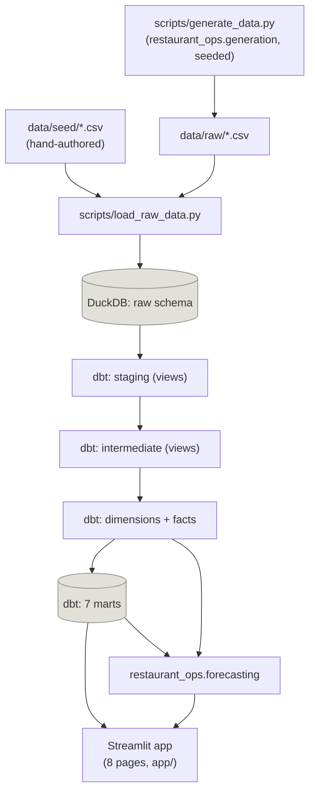

# Architecture

Covers the data platform through Phase 8 (generation → DuckDB + dbt →
Streamlit → forecasting).

## System diagram



The ASCII version below carries the same flow with more per-layer detail
(table/model names); this diagram is the at-a-glance version.

## Data flow

```
data/seed/*.csv (hand-authored)  ─┐
                                   ├─► scripts/load_raw_data.py ─► DuckDB: raw schema
data/raw/*.csv (generated)  ──────┘         (+ loaded_at, source_file,
     ▲                                        batch_id, record_hash)
     │                                              │
scripts/generate_data.py                            ▼
(restaurant_ops.generation,                   dbt: staging (views)
 seeded, reproducible)                              │
                                                     ▼
                                            dbt: intermediate (views)
                                          reusable business logic —
                                       food cost, hourly demand, labour
                                        cost by daypart, ingredient
                                       consumption, review-to-order joins
                                                     │
                                                     ▼
                                         dbt: dimensions + facts (tables)
                                        dim_date, dim_menu_item, dim_ingredient,
                                        dim_employee, dim_supplier, dim_channel
                                        fact_orders, fact_order_items,
                                        fact_employee_shifts, fact_reviews,
                                        fact_inventory_movements
                                                     │
                                                     ▼
                                            dbt: marts (tables)
                                    mart_daily_performance, mart_menu_engineering,
                                  mart_channel_profitability, mart_labour_productivity,
                                   mart_service_quality, mart_inventory_risk,
                                              mart_review_analysis
                                                     │
                                                     ▼
                                        Streamlit application (`app/`)
```

Two independent producers feed the raw layer: `data/seed/*.csv` is
hand-authored and rarely changes (menu, ingredients, suppliers, recipes,
employees); `data/raw/*.csv` is generated fresh by
`scripts/generate_data.py` every run, from a seeded
`numpy.random.Generator` threaded through daily-context, staffing,
orders/order-items, reviews, and inventory generation in that fixed
order (see `docs/business_rules.md`).

## Layer responsibilities

- **Raw** (`raw` schema): source fields with minimal modification, plus
  load metadata. `scripts/load_raw_data.py` computes `record_hash` from
  the *original* columns only (before metadata is added), so it reflects
  content, not when/how a row was loaded.
- **Staging** (`staging` schema, views): one model per raw table.
  Renames for consistency, casts types (raw timestamps/dates arrive as
  `VARCHAR` — pandas doesn't parse dates on `read_csv` without being
  told to, and the raw layer is deliberately not the place to fix that),
  standardises text/booleans, converts empty strings to null.
- **Intermediate** (`intermediate` schema, views): reusable business
  logic that more than one downstream model would otherwise have to
  repeat — order-level profitability, menu-item food cost (recomputed
  independently in SQL from `stg_recipes` x `stg_ingredients`, rather
  than trusting the Python-computed column blindly), hourly kitchen
  demand, labour cost by date/daypart, ingredient consumption, and the
  review-to-order join.
- **Dimensions and facts** (`main` schema, tables): the star schema.
  Facts are built from intermediate models (not straight from staging)
  where reusable logic exists, so the fact tables carry finished,
  documented figures. Every fact's grain is stated at the top of its
  `.sql` file.
- **Marts** (`marts` schema, tables): one mart roughly per Streamlit
  page (see `docs/data_dictionary.md` isn't extended for these yet —
  each mart's grain and column meanings are documented as dbt model/column
  descriptions instead; run `dbt docs generate && dbt docs serve
  --project-dir dbt_restaurant` to browse them, rather than maintaining
  a second copy of the same documentation by hand).

## Why DuckDB

Single-file, zero-configuration, embedded analytical database — no
server process, no credentials, nothing else to install or run. For a
project sized at ~40k orders/~90k order items/~170k total rows, an
in-process OLAP engine with native columnar execution and first-class
pandas/CSV interop is a better fit than standing up Postgres, and it's
what `dbt-duckdb` was built for. The whole database is one file
(`data/database/restaurant.duckdb`, gitignored, fully reproducible from
`scripts/generate_data.py` + `scripts/load_raw_data.py` + `dbt build`).

## Why dbt

The project's own spec requires layered SQL transformations (staging →
intermediate → dimensions/facts → marts), documented grains, and
schema/data tests — that's dbt's exact purpose, and doing it by hand in
raw Python/SQL would mean reinventing dependency resolution (`ref()`),
testing, and documentation generation that dbt already provides.
`dbt-duckdb` needed no extra setup beyond the two config files below.

## Configuration notes worth knowing

- **`dbt-duckdb` resolves `profiles.yml`'s `path` relative to the shell's
  current working directory at invocation time, not the project
  directory.** `dbt_restaurant/profiles.yml.example` assumes dbt is
  always invoked from the repository root — see the comment in that file.
- **Schema naming**: `dbt_restaurant/macros/generate_schema_name.sql`
  overrides dbt's default behaviour, which prefixes every custom schema
  with the target schema (e.g. `main_staging`). Without that override,
  every layer's schema name would double up; with it, they're just
  `staging`, `intermediate`, `main` (dimensions/facts), and `marts`.
- **`seeds/channel_reference.csv`**: channel metadata (label, delivery
  flag, commission rate) is a dbt seed rather than derived from
  generated data, since it's fixed reference information the generator
  doesn't produce. Its `commission_rate` values are hand-kept in sync
  with `config/simulation.yaml`'s channel commission rates — a small,
  deliberate duplication documented here so it doesn't go stale
  silently.

## Streamlit application (`app/`)

`app/Home.py` is the entrypoint (`uv run streamlit run app/Home.py`);
`app/pages/1_Executive_Overview.py` through `7_Customer_Experience.py`
are auto-discovered by Streamlit's multipage convention. `app/components/`
holds everything shared across pages: `database.py` (a cached read-only
DuckDB connection plus query functions), `filters.py` (sidebar filter
widgets and formatting helpers), `charts.py` (Plotly styling/palette),
and `insights.py` (pure, UI-free functions that generate the short
natural-language summaries on Page 1).

Every page reads from the dbt-built warehouse, never the raw CSVs. Most
pages read a single mart via `database.load_mart(name)` — that covers
everything except three spec requirements that need finer grain than any
mart carries:

- Page 2's per-item drill-down (channel/hour/temperature-group demand
  for a selected menu item)
- Page 4's hourly-by-weekday heatmap
- Page 1's auto-summary, which compares actual prep time against
  `fact_orders.promised_minutes`

For those, the app queries `main.fact_orders`, `main.fact_order_items`,
`main.dim_date`, and `intermediate.int_hourly_demand` directly —
still dbt-built DuckDB tables, just outside the `marts` schema. This was
a deliberate scope decision (querying the existing fact/dim layer from
the app) rather than reopening the dbt layer to add the missing grain as
new marts.

Each `app/pages/*.py` file inserts its own directory onto `sys.path`
before importing from `components` (`sys.path.insert(0,
str(Path(__file__).resolve().parents[1]))`) rather than relying on
Streamlit's multipage import behaviour, since that behaviour isn't
guaranteed to add the same directory to the path for `Home.py` and for
scripts under `pages/`.

## Forecasting (`src/restaurant_ops/forecasting/`)

A separate package, mirroring the `generation`/`validation` module
pattern, rather than app-embedded logic — keeps the modelling code
directly unit-testable without a running warehouse or Streamlit process.

- `features.py` — turns `mart_daily_performance` into a model-ready
  frame (day-of-week/month, weather, lag/rolling order-count features).
  Pure function, no I/O.
- `evaluation.py` — chronological train/test splitting and MAE/RMSE/MAPE.
- `models.py` — the four candidate models (naive, moving average, linear
  regression, random forest) behind a shared `fit(train).predict(df)`
  interface, so the Streamlit page and evaluation loop treat them
  uniformly.
- `staffing.py` — translates a predicted order count into a recommended
  Kitchen/Front of House headcount, entirely from observed
  `mart_labour_productivity`/`fact_employee_shifts` data.
- `future.py` — the recursive 7-day-ahead forecast, reusing
  `restaurant_ops.generation.weather.generate_daily_context` to produce
  synthetic weather/calendar features for the days beyond the historical
  dataset's end.

`app/pages/8_Demand_Forecast.py` is a thin consumer of this package: it
loads `mart_daily_performance`/`mart_labour_productivity` plus
`fact_employee_shifts` (via a new `database.load_employee_shifts()`,
following the same fact-table-access pattern as Phase 7's drill-downs),
runs the pipeline once behind `st.cache_data`, and displays the results.
See `docs/business_rules.md` for the exact feature list, split, and
staffing formula.
