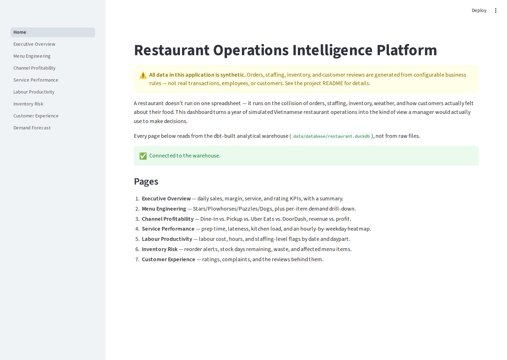
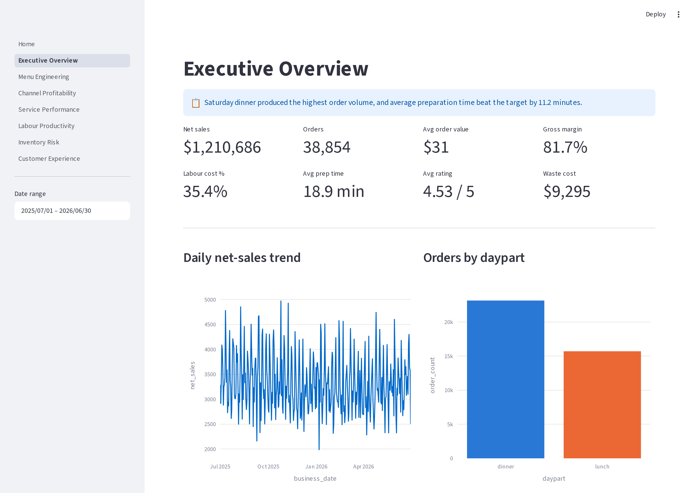
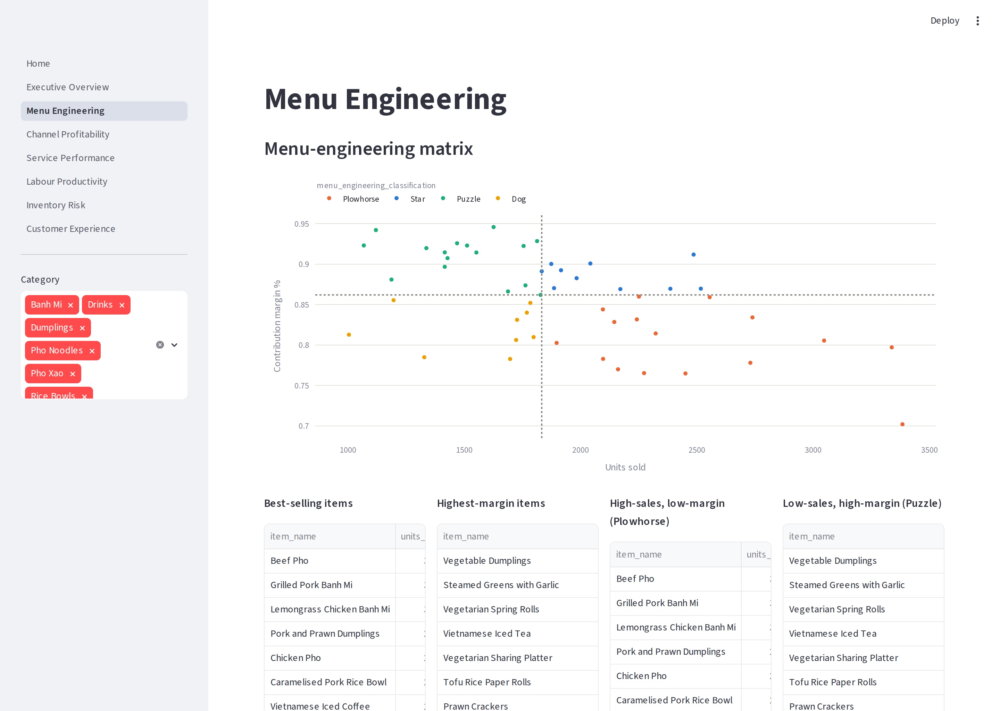
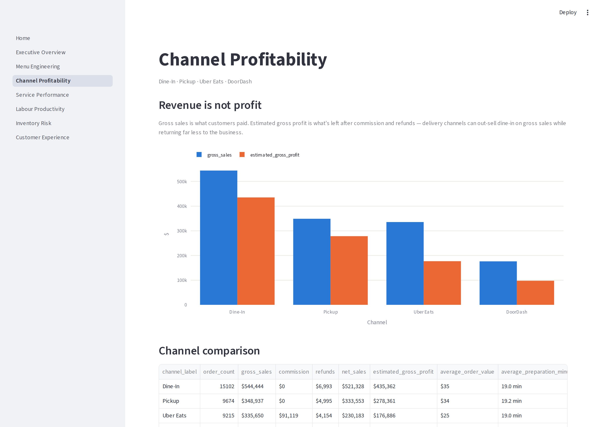
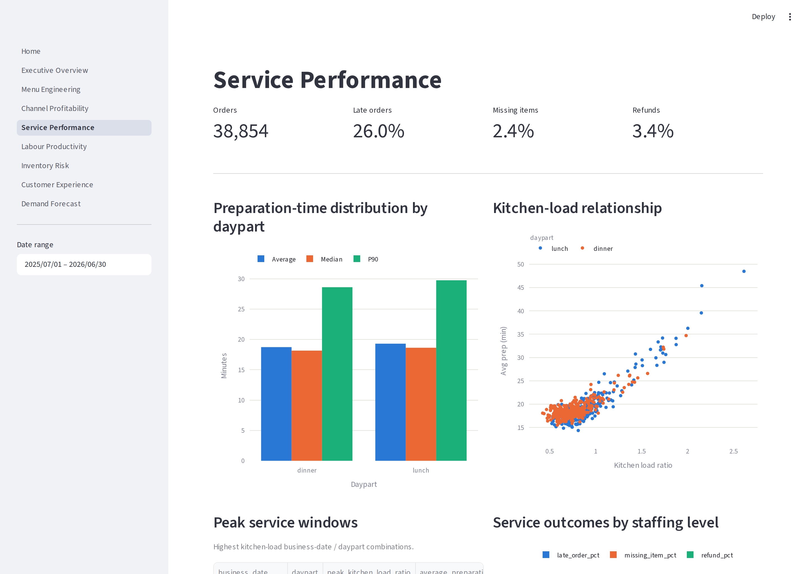
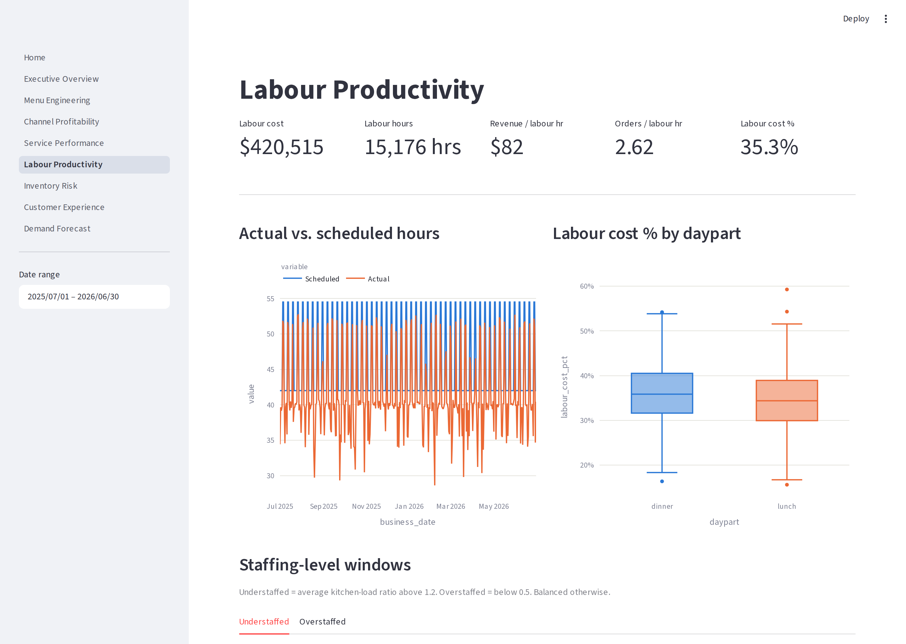
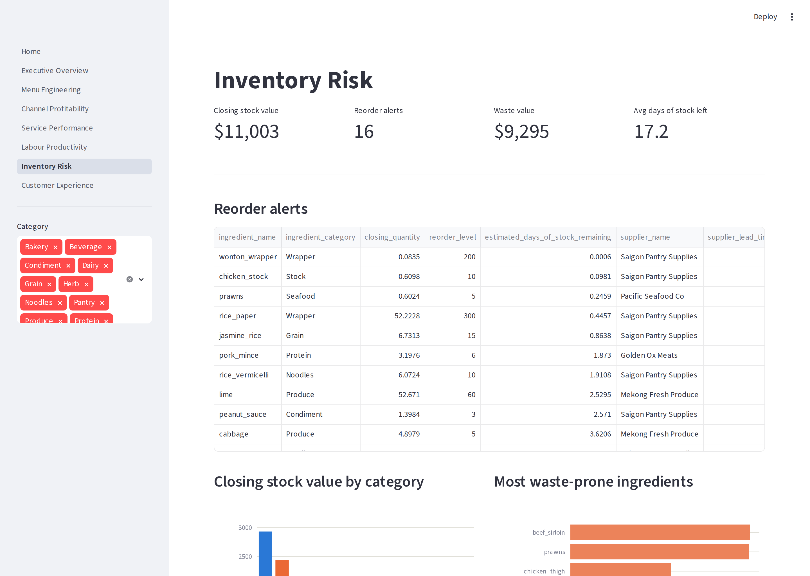
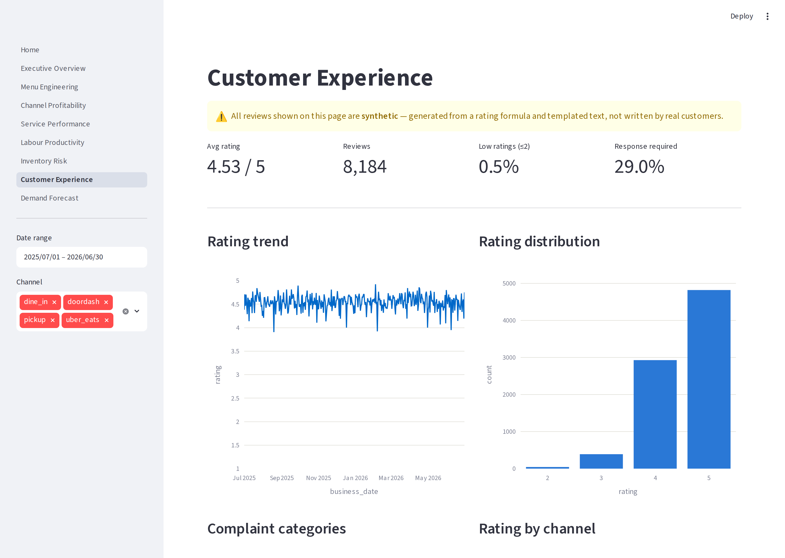
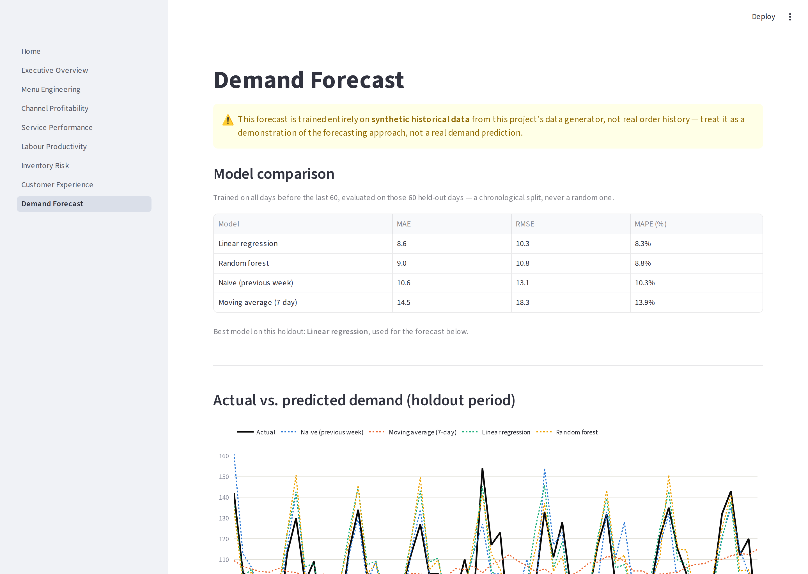

# Screenshots

A page-by-page look at the Streamlit dashboard (`app/`), running against
the full synthetic year (2025-07-01 → 2026-06-30). See the main
[README](../README.md#demo) for how to run it yourself, and
`docs/architecture.md` for which mart (or fact/dim tables) each page
reads from.

All data shown is synthetic — see the
[README disclaimer](../README.md#disclaimer).

## Home

Landing page: a synthetic-data warning, a warehouse connectivity check,
and a one-line guide to each page below.

## 1. Executive Overview

Daily net sales, order count, margin, labour cost %, prep time, rating,
and waste cost — plus an automatically generated one-line summary of the
busiest day/daypart and how its prep time compared to target.

## 2. Menu Engineering

The Star/Plowhorse/Puzzle/Dog matrix (`mart_menu_engineering`), best-
seller and highest-margin tables, category comparison, and a per-item
drill-down (price, margin, channel split, demand by hour, demand by
temperature band) for any menu item you select.

## 3. Channel Profitability

Dine-In vs. Pickup vs. Uber Eats vs. DoorDash — gross sales next to
estimated gross profit, making the commission bite on delivery channels
explicit rather than implied.

## 4. Service Performance

Prep-time distribution by daypart, the kitchen-load-vs-prep-time
relationship, peak service windows, service outcomes by staffing level,
and an hourly demand heatmap by weekday.

## 5. Labour Productivity

Labour cost, hours, revenue/orders per labour hour, actual vs. scheduled
hours, and understaffed/overstaffed windows by business date and daypart.

## 6. Inventory Risk

Reorder alerts (with the menu items they'd affect), closing stock value
by category, the most waste-prone ingredients, and estimated days of
stock remaining per ingredient.

## 7. Customer Experience

Rating trend and distribution, complaint categories, rating by channel/
daypart/preparation-time band, and low-rating review examples — with a
clear synthetic-reviews disclaimer.

## 8. Demand Forecast

Four candidate models (naive previous-week, 7-day moving average, linear
regression, random forest) compared with a strict time-based holdout,
actual-vs-predicted demand over that holdout, an upcoming 7-day forecast,
and a recommended Kitchen/Front of House staffing level for each of
those days.

